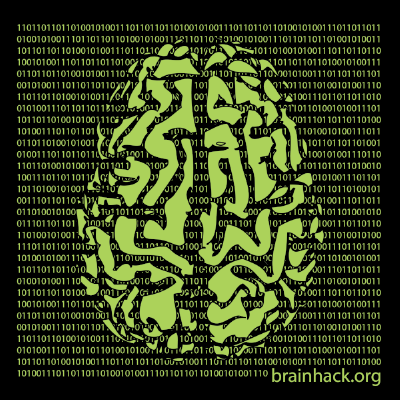

Brainhack School
=================

.. note:: This documentation corresponds to Brainhack School 2023.

An overview of the event is available on our `website <https://school-brainhack.github.io>`.

Brainhack School
------------------------------------

Brainhack school is a community-driven educational event in neuroscience and open science. It is run in parallel at multiple sites across the world, where small groups of students come together in person for four weeks. All students and instructors interact through a central discord server, and share the same training modules. Students also collaborate across sites in project teams.

Why brainhack school?
------------------------------------

Coding and other data science skills are much better acquired and solidified through practice. After a one week bootcamp, most of the brainhack training consists of open and collaborative work on a project of your choice. The distributed nature of brainhack school help to make it sustainable by sharing the load of preparing the material across many individuals. It also allows young researchers across the world to work together and build strong collaborations across disciplinary and geographical boundaries. 

